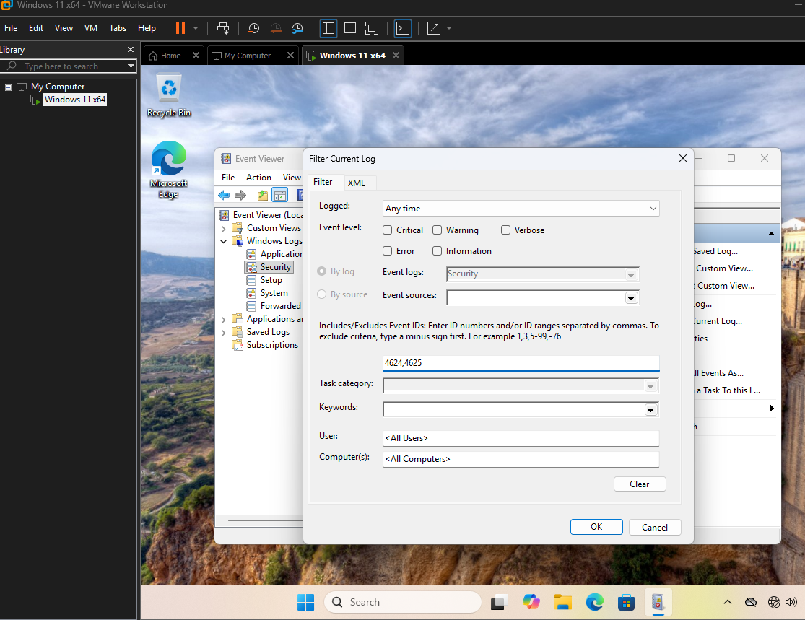
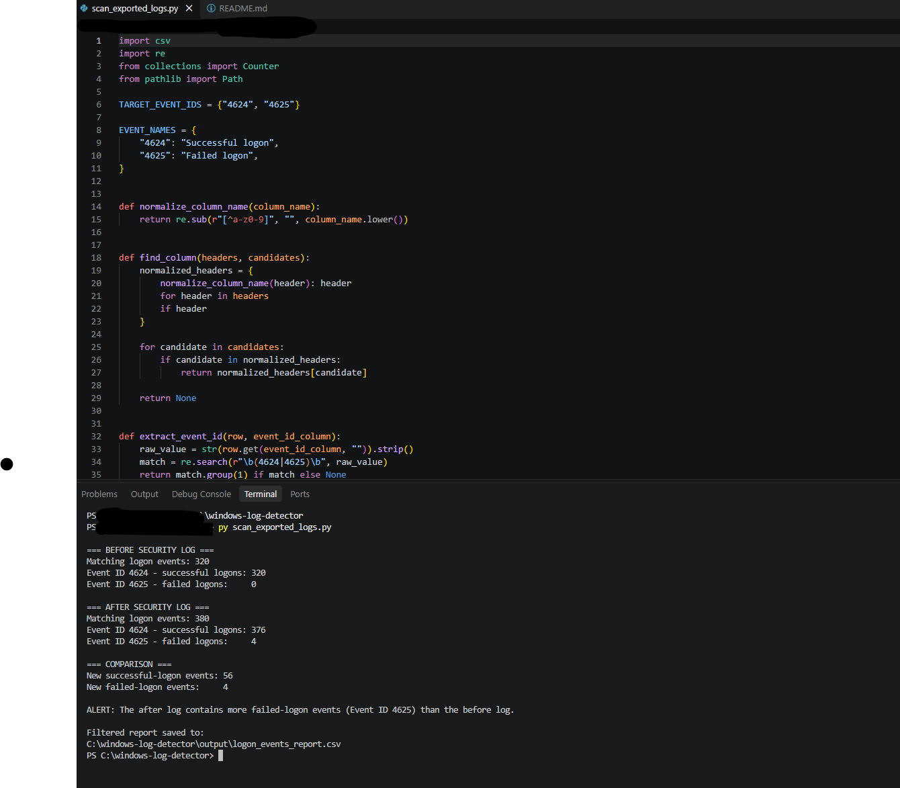
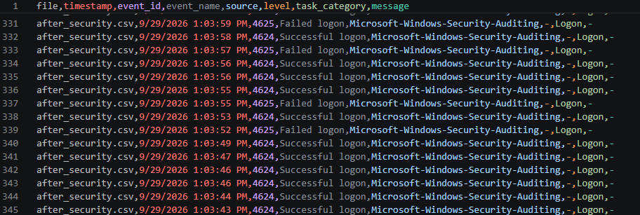

# Windows Security Logon Event Detector

A Python-based blue-team log analysis project that scans exported Windows
Security event logs for successful and failed logon activity.

## Overview

This project analyzes exported Windows Security log data in CSV format and
identifies authentication events using:

- Event ID 4624: Successful logon
- Event ID 4625: Failed logon

The tool compares a baseline ("before") export with an "after" export from a
controlled VMware Windows 11 lab. It highlights increases in failed logons and
creates a filtered CSV report for review.

## Why I Built This

Windows authentication events are valuable to SOC analysts and incident
responders because repeated failed logons can indicate password guessing,
misconfiguration, a locked-out account, or other suspicious authentication
activity.

This project was built to practice:

- Python scripting and CSV parsing
- Windows Event Viewer and Security logs
- Basic detection engineering
- Security alert reporting
- Safe, isolated lab testing
- Documentation and analyst-style investigation workflow

## Lab Environment

| Component | Purpose |
|---|---|
| Host Windows computer | Python development and log analysis |
| VMware Workstation | Virtualization platform |
| Windows 11 VM | Controlled log generation |
| Event Viewer | Security-log review and export |
| VS Code | Python development environment |
| Python 3.13 | Script execution |

All test activity was performed in an isolated, authorized lab environment.
No production, employer, school, or third-party logs are included.

## Project Workflow

```text
Windows 11 VM
    ↓
Generate authorized test logon activity
    ↓
Export Security logs before and after testing
    ↓
Transfer sanitized CSV exports to host
    ↓
Python parser filters Event IDs 4624 and 4625
    ↓
Compare baseline and after-test counts
    ↓
Write filtered CSV report and print summary
```

## Detection Logic

| Event ID | Meaning | How this project uses it |
|---|---|---|
| 4624 | Successful logon | Counts successful authentication activity |
| 4625 | Failed logon | Counts failed authentication activity and flags increases after testing |

Current detection rule:

> Alert when the after-test log contains more Event ID 4625 records than the baseline log.

This is a beginner-friendly baseline rule. In a real environment, detections
would also consider time windows, account names, source IP addresses, logon
type, expected administrative activity, and asset context.

## Installation

1. Install Python 3.13 or later.
2. Clone this repository.
3. Open the project folder in VS Code.
4. Confirm that VS Code has selected a Python interpreter.
5. Place sanitized CSV files in the project folder or `data/` directory.

No third-party Python packages are required for the CSV version.

## Usage

Run the script from the project directory:

```powershell
python src\scan_exported_logs.py
```

The script expects these files:

```text
before_security.csv
after_security.csv
```

It creates this report:

```text
output\logon_events_report.csv
```

## Example Output

```text
=== BEFORE SECURITY LOG ===
Matching logon events: 320
Event ID 4624 - successful logons: 320
Event ID 4625 - failed logons:     0

=== AFTER SECURITY LOG ===
Matching logon events: 380
Event ID 4624 - successful logons: 376
Event ID 4625 - failed logons:     4

=== COMPARISON ===
New successful-logon events: 56
New failed-logon events:     4

ALERT: The after log contains more failed-logon events (Event ID 4625) than the before log.
```

## Limitations

- The first version parses CSV exports rather than native `.evtx` files.
- CSV column names may vary by Windows version, Event Viewer language, and
  export format.
- Event ID 4625 alone does not prove an attack; failed logons can occur because
  of mistyped passwords, expired credentials, saved credentials, services, or
  configuration errors.
- The current version compares event counts and does not yet correlate by
  account, source IP, logon type, or time window.
- The project uses controlled lab data and is not a replacement for a SIEM,
  EDR, or enterprise incident-response process.

## Planned Improvements

- Add native `.evtx` parsing with `python-evtx`
- Extract account name, source IP, workstation name, and logon type
- Detect repeated failed logons from one account or source within a time window
- Add a "failed logon followed by successful logon" correlation rule
- Add configurable thresholds and severity levels
- Add JSON output in addition to CSV
- Add unit tests using sanitized sample logs
- Add Windows Firewall log parsing for denied connections
- Map detection logic to MITRE ATT&CK techniques where appropriate

## Screenshots

### Windows Security log evidence

Filtered Event Viewer output from the isolated Windows 11 VM. The log includes controlled successful logons (Event ID 4624) and failed logons (Event ID 4625).



### Detector execution

The Python script compares the exported before/after Security-log CSV files and flags increased failed-logon activity.



### Generated alert report

The tool writes a CSV report that can be reviewed by an analyst or imported into another workflow.




## Author

Christopher Ostrander

Bachelor's Degree in Cybersecurity  
